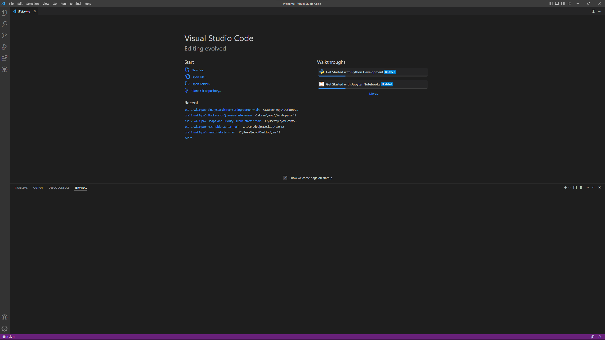
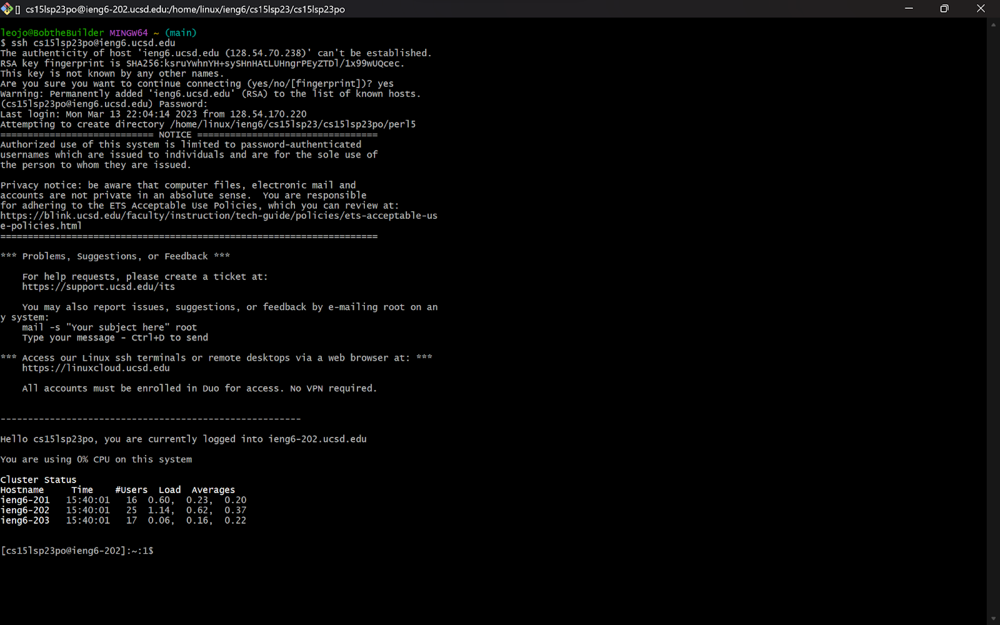
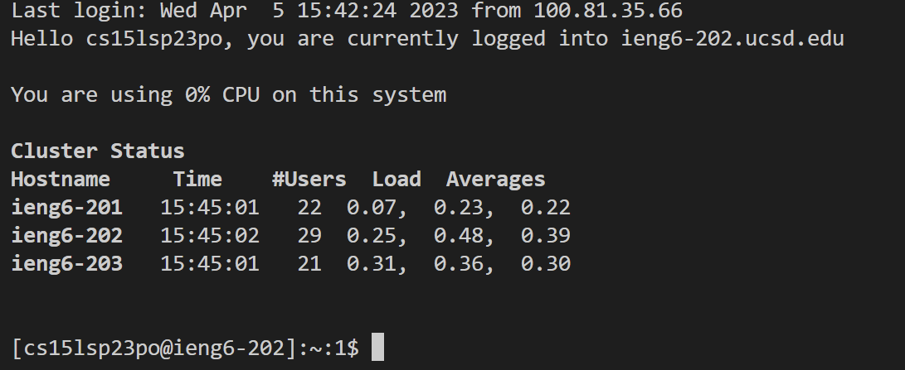
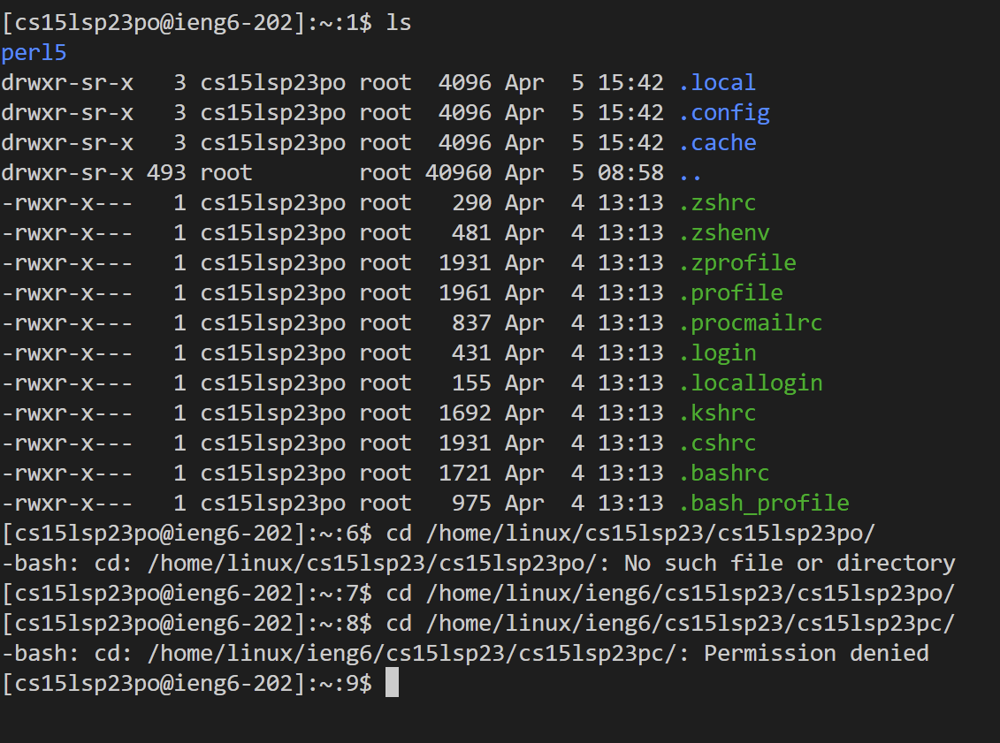

Hey,

So you're trying to log onto an ieng6 account. Here's how you do it. 

## What you'll need

* VS Code
* Remote Connection through SSH

Commands to Try
---
---

1. **VS Code**

 To install VScode, go to [VScode](https://code.visualstudio.com/download) and download the appropriate version based on your OS (Windows, Linux, or MacOs).
 From there you can open your file explorer and execute the .exe file. I already had VScode installed, and was able to bypass this step. 
 Once you have VScode downloaded, you can open the program and it should look like: 
  
 ---

2. **Remote Connection through SSH**

For this step, you'll need to create an account or log into an already existing account [here.](https://sdacs.ucsd.edu/~icc/index.php)
If using Windows, make sure you have [Git](https://gitforwindows.org/) installed on your machine. From there, to use ssh, you will need to open a terminal in VScode by clicking on 'Terminal' and then 'New Terminal'. Then enter the following command ( where zz is replaced by your unique identifier from your account name): `ssh cs15lsp23zz@ieng6.ucsd.edu`. Once you enter the command, hit enter to run it. You will be prompted to enter your password.\ (Please note your password will not be displayed while typing.)
Your screen after successfully loging in should look like: 
 
or

The differences below are based on whether you used Bash(1) or VScode terminal(2).
---

3. **Commands to Try**

Some commands you can try are: 'cd', 'ls', 'pwd', 'mkdir', and 'cp'.
Commands I tried are 'ls', and 'cd'.

'cd' is used to change directory. From there you can try to access other directories on the server. I tried to access a lab partner's directory.
ls is used to list files and folders in a current path. When I used this command I saw all the files and folders in my current directory.

Other commands are 'pwd'(print working directory), 'mkdir'(make directory), and 'cp'(copy).
---
