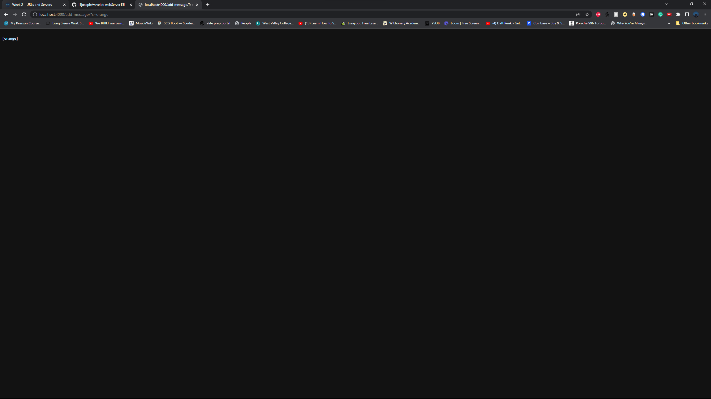
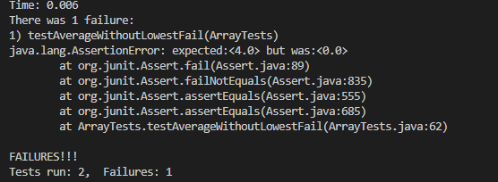

Hey,
So you're back for more! In this lab report, I'll be covering some more new topics.

---

# Part 1: Building a StringServer.

Here, we'll be going over the code used to create and build a String Server.

Code for StringServer.
```java
import java.io.IOException;
import java.net.URI;
import java.util.ArrayList;

class StringServer implements URLHandler {
    // The one bit of state on the server: a number that will be manipulated by
    // various requests.
    ArrayList<String> string = new ArrayList<String>();

    @Override
    public String toString() {
        return String.join(System.lineSeparator(), string);
    }

    public String handleRequest(URI url) {
        if (url.getPath().equals("/")) {
            return String.format(string.toString());
        } else {
            System.out.println("Path: " + url.getPath());
            if (url.getPath().contains("/add")) {
                String[] parameters = url.getQuery().split("=");
                if (parameters[0].equals("s")) {
                    string.add(parameters[1]);
                    return String.format("\n" + string.toString());
                }
                if(parameters[0].equals("search")){
                    String result = "";
                    for(String s: string)
                    {
                        if (s.contains(parameters[1])){
                            result = result + "\n" +s; 
                        }
                    }
                    return(String.format(result));
                }
            }
            return "404 Not Found!";
        }
    }


}


class SearchEngine {
    public static void main(String[] args) throws IOException {
        if(args.length == 0){
            System.out.println("Missing port number! Try any number between 1024 to 49151");
            return;
        }

        int port = Integer.parseInt(args[0]);

        Server.start(port, new StringServer());
    }
}
  ```
  Note: Most of this code was reused from an inclass lab.
  
  
  
  * All methods are being called. This includes `toString` & `handleRequest`.
  * `handleRequest` takes in URI object arguements which is the url on which our site is hosted.
  * The value changes pased on port number.

 
  
  * All methods are being called. This includes `toString` & `handleRequest`.
  * `handleRequest` takes in URI object arguements which is the url on which our site is hosted.
  * The value changes pased on port number.

---
  
# Part 2: Debugging
  
  For this part of the report, I will be taking you through the process of identifying and fixing a failure inducing input.
  
  The mothod initially lookded like this:
  
```java
 // Averages the numbers in the array (takes the mean), but leaves out the
  // lowest number when calculating. Returns 0 if there are no elements or just
  // 1 element in the array
  static double averageWithoutLowest(double[] arr) {
    if(arr.length < 2) { return 0.0; }
    double lowest = arr[0];
    for(double num: arr) {
      if(num < lowest) { lowest = num; }
    }
    double sum = 0;
    for(double num: arr) {
      if(num != lowest) { sum += num; }
    }
    return sum / (arr.length - 1);
  }
```

A failure inducing input would be: 
```java
    @Test
  public void testAverageWithoutLowestFail() {

      double[] input2 = {4, 4, 4};
      double output2 = ArrayExamples.averageWithoutLowest(input2);
      assertEquals(4.0, output2, 0.0001);
     
      double[] input5 = {1, 1, 2};
      double output5 = ArrayExamples.averageWithoutLowest(input5);
      assertEquals(1.5, output5, 0.0001);
 
  }
```

While input that passed looked like:
```java
    @Test
  public void testAverageWithoutLowestPass() {
      double[] input1 = {1, 2, 3};
      double output1 = ArrayExamples.averageWithoutLowest(input1);
      assertEquals(2.5, output1, 0.0001);
    
      double[] input3 = {5};
      double output3 = ArrayExamples.averageWithoutLowest(input3);
      assertEquals(0.0, output3, 0.0001);
 
      double[] input4 = {};
      double output4 = ArrayExamples.averageWithoutLowest(input4);
      assertEquals(0.0, output4, 0.0001);
  }
```

In terms of symptoms, the following is the result fo running the above JUNIT tests.


What we did to fix it was to update the for loop to accurately identify and remove the lowest value, therefore fixing the logic error that caused the failure.

```java
  //fixed version of averageWithoutLowest
    static double averageWithoutLowest(double[] arr) {
      if(arr.length < 2) { return 0.0; }
      double lowest = arr[0];
      for(double num: arr) {
        if(num < lowest) { lowest = num; }
      }
      double sum = 0;
      for(double num: arr) {
        sum += num;
      }
      sum -= lowest;
      return sum / (arr.length - 1);
    }
```

---

# Part 3: Learnings

From the lab in week 2, a couple things that I learned include using curl to run a web server thru the terminal, and creating a string checker.
In week 3, I learned how to run JUNIT tests thru the terminal. I had been running them using VScodes testing enviroment before.

