## Part 1: Debugging

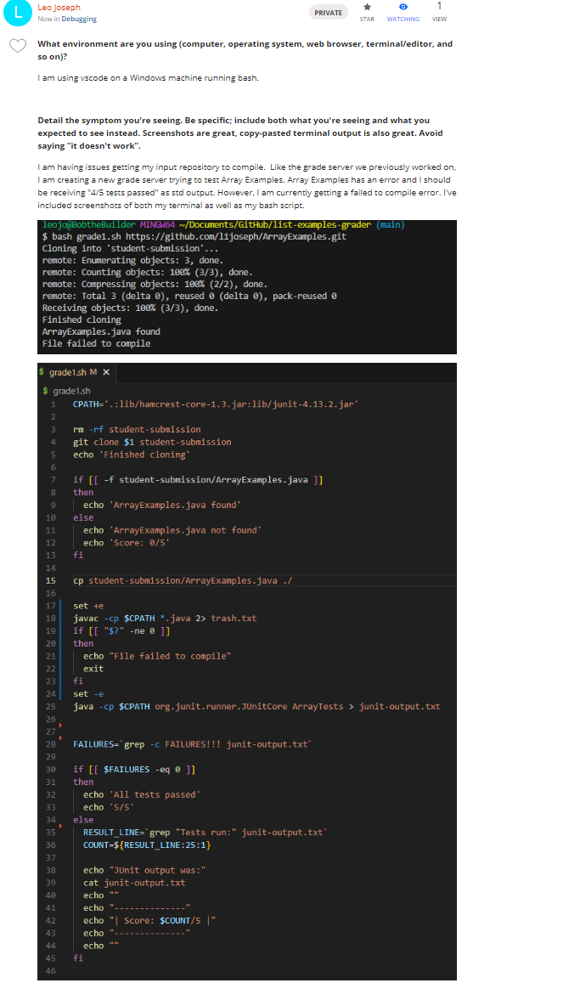
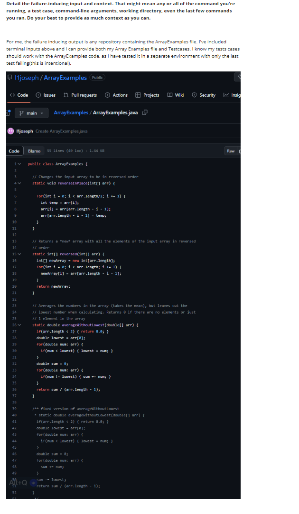
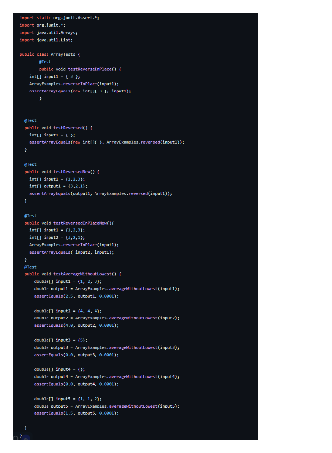

1. Hi Leo, Have you tried double checking your class path a(make sure you are using the right cmd for your OS)?
2. 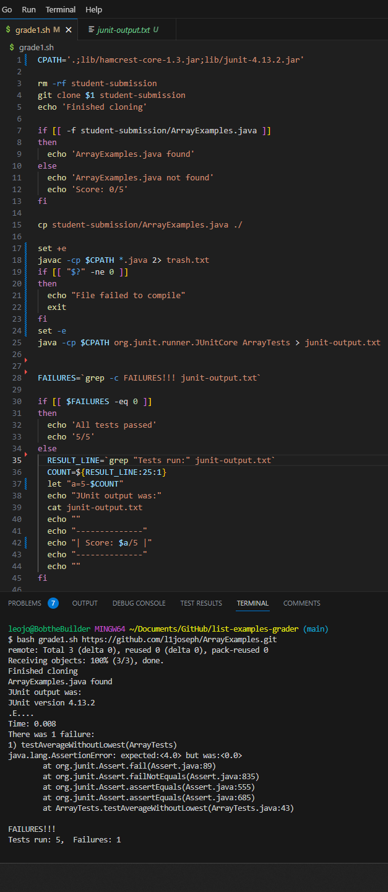 
Hi, Thank you so much. I just realized that since I was running this from my local machine and not my IENG6 account that my class path would have to be the Windows command. It works now!!!
3. I created a new repository to store ArrayExamples.java. I also forked list-examples-grader and wrote a completely new grading script to accept the ArrayExamples as input. So my file structure for list-example-grader/ looks like
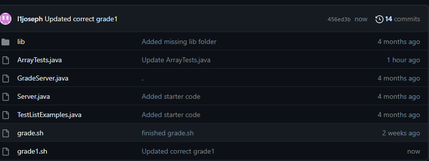

Before(for grade script)
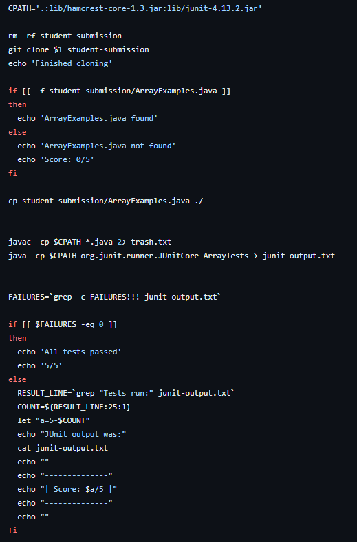
(ArrayExamples) 
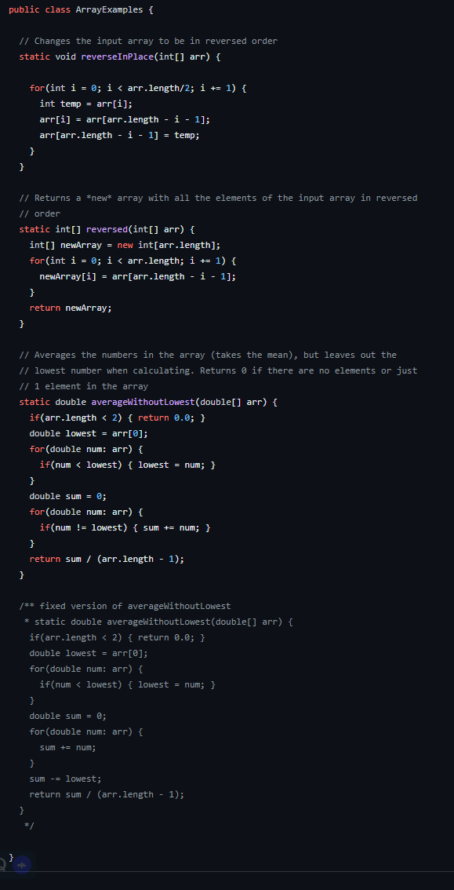
(ArrayTests)
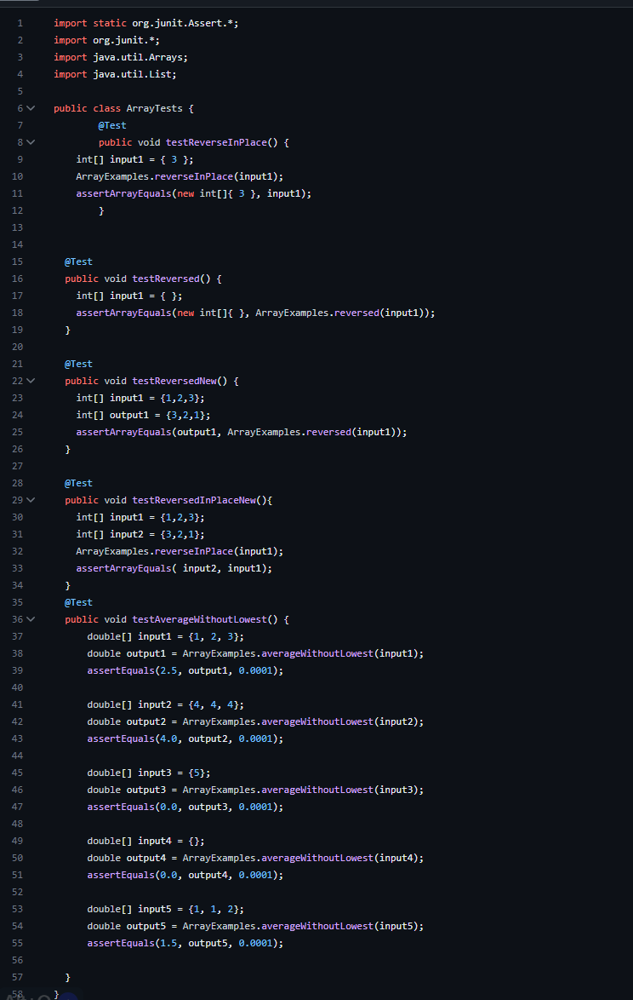

Cmd Line prompts 
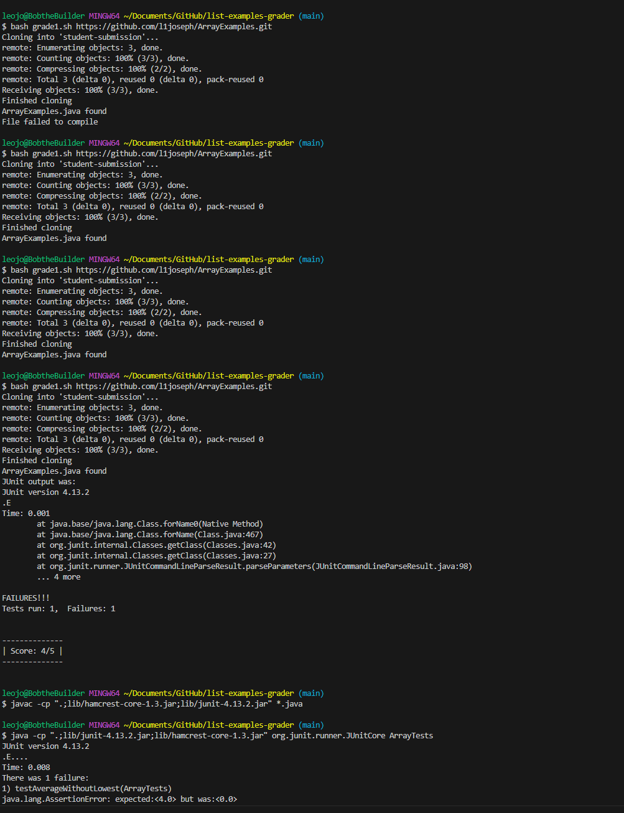
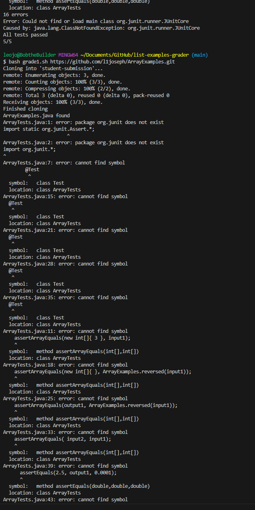

What I did to fix the bug was change the linux Class Path for junit to the windows Class Path. However, I had a lot of issues setting the file structure up, when it came to adding files to a new repository ad writng a new grade script from scratch. I've included a few of the cmd line prompts I ran as I was debugging above. This was more of a live walk through of me creating a bug having no idea how to fix it, and walking myself throught the debugging process instead of having a solution before I started this Lab. I will also try to include more prompt below, however this does not encompass all the changes I made to the files them self, but is just a portion to the actual struggle I went through while debugging.

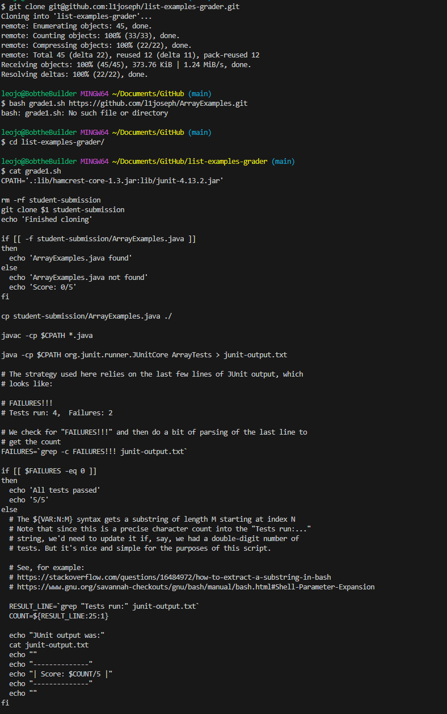

## Part 2: Reflection

I think one of the most applicable things we learned was executing shell commands though java. Even though I have taken many other CSE classes, I never learned about this. It has a lot of utility, and it was extremeley interesting to learn how these processes like ProcessBuilder and Runtime functioned in terms of theri heirarchy and such. It is such a useful tool, being able to run shell commands, execute scripts, run the terminal, set working directions, and even manipulate enviroment varibale though core Java classes. VIM, although not extremely user friendly is also very useful for classes like CSE 30.
